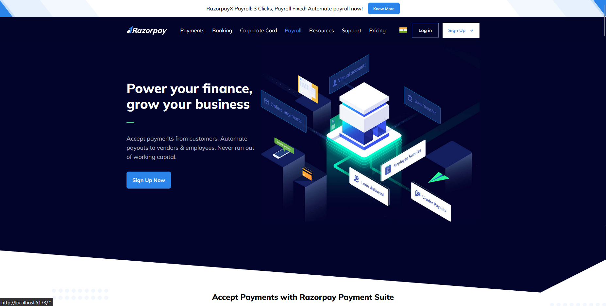

# 💸 Razorpay Clone – Responsive Dashboard UI

A modern and responsive **Razorpay dashboard clone** built using **React.js** and **Tailwind CSS**, featuring a clean UI, reusable components, and responsive design principles.

## 🚀 Live Demo

🔗 [View Live on Netlify](https://bhashkar-yadav-razorpay-clone.netlify.app/)

---

## 🛠 Tech Stack

- ⚛️ React.js
- 🎨 Tailwind CSS
- 🔁 React Router DOM
- ⚙️ Vite (or Create React App)
- 📱 Fully Responsive Design (Mobile, Tablet, Desktop)

---

## 📸 Screenshots

> *(Add your screenshots in a `screenshots/` folder)*


<br/>


---

## ✨ Features

- 📊 Razorpay-style dashboard UI
- 📱 Responsive layout using Tailwind's utility-first classes
- 🧩 Reusable UI components (Sidebar, Navbar, Cards, etc.)
- 🌙 Optional dark mode toggle
- ⚡ Optimized and fast performance

---

## 🧑‍💻 Getting Started

To run this project locally:

```bash
git clone https://github.com/bhaskar-5625/razorpay-clone.git
cd razorpay-clone
npm install
npm run dev    # or npm start if using Create React App
